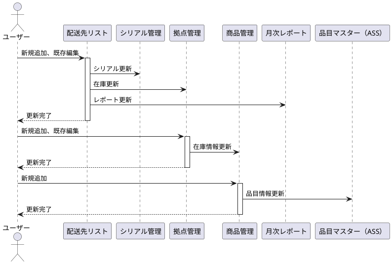

# シーケンス図まとめ

## SpaceCore

## Atlas

```plantuml
@startuml

actor ユーザー as user
participant "配送先リスト" as delivery
participant "シリアル管理" as snum
participant "拠点管理" as unit
participant "商品管理" as device
participant "月次レポート" as report
participant "品目マスター（ASS）" as item

user -> delivery++: 新規追加、既存編集
  delivery -> snum: シリアル更新
  delivery -> unit: 在庫更新
  delivery -> report: レポート更新
return 更新完了
user -> unit++: 新規追加、既存編集
  unit -> device: 在庫情報更新
return 更新完了
user -> device++: 新規追加
  device -> item: 品目情報更新
return 更新完了

@enduml
```
