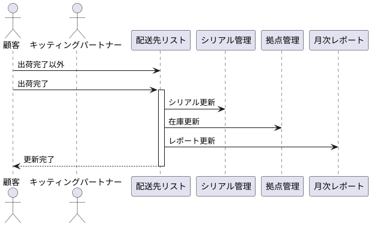

# シーケンス図まとめ

## SpaceCore

## Atlas

```plantuml
@startuml

actor 顧客 as user1
actor キッティングパートナー as user2
participant "配送先リスト" as delivery
participant "シリアル管理" as snum
participant "拠点管理" as unit
participant "月次レポート" as report

user1 -> delivery: 出荷完了以外
user1 -> delivery++: 出荷完了
  delivery -> snum: シリアル更新
  delivery -> unit: 在庫更新
  delivery -> report: レポート更新
return 更新完了

@enduml
```
